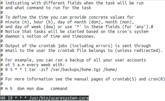
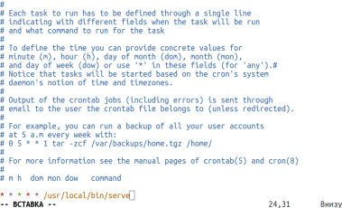
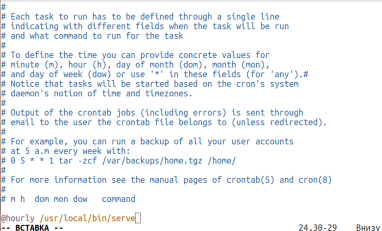

## CRON topshiriqlarni rejalashtirgichdan foydalanish

**CRON** – bu demon dastur. Uning asosiy vazifasi foydalanuvchi tomonidan ko'rsatilgan jarayonlarni foydalanuvchi tomonidan belgilangan vaqtlarda, masalan, ma'lum bir davriylik bilan bajarishdir.

Keling, bitta cron topshirig’ini sozlash uchun sintaksisni ko'rib chiqamiz:
`daqiqa soat kun oy hafta_kuni /bajariluvchi/faylga/yo’l`

Shuni ta’kidlash lozimki, buyruqqa to'liq yo'lni yozish shart, chunki cron nomidan ishga tushiriluvchi buyruqlar uchun **PATH** muhit o'zgaruvchisi ajralib turadi. Sana va vaqt raqamlar yoki `*` belgisi yordamida ko'rsatiladi. Bu belgi jarayon har safar bajarilishi kerakligini anglatadi.

### Cron sozlamalariga misollar:

- Avvalambor, superfoydalanuvchi uchun cron vazifalarini ko’rib chiqish mumkin, buning uchun `crontab -l` buyrug'idan foydalanish mumkin:  
  

- `-r` buyrug'i bilan barcha mavjud vazifalarni o'chirishingiz mumkin.

- Eng oddiy misol -- `* * * * * /usr/local/bin/serve` buyrug'i bilan har daqiqada biror-bir jarayonni ishga tushirish:  
  

- Siz haftaning istalgan daqiqasini, soatini va kunini tanlashingiz mumkin, masalan, seshanba kuni 15.30:  
  `30 15 * * 2 /usr/local/bin/serve`

- Bundan tashqari, ba'zi tez-tez ishlatiladigan to'plamlar uchun maxsus o'zgaruvchilar ixtiro qilingan, mana ular:
  - `@reboot` -- yuklashda, faqat bir marta
  - `@yearly`, `@annually` -- yiliga bir marta
  - `@monthly` -- oyda bir marta
  - `@weekly` -- haftada bir marta
  - `@daily`, `@midnight` -- har kuni
  - `@hourly` -- har soatda

  Masalan, skriptni har soatda ishga tushirish uchun `@hourly /usr/local/bin/serve` buyrug'idan foydalanish mumkin:  
  
