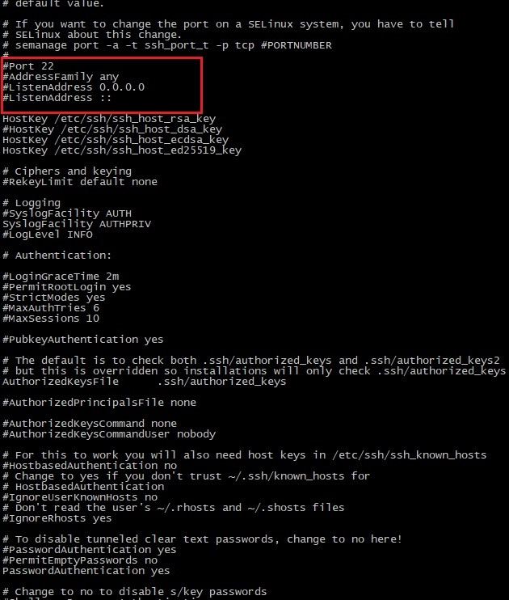

## SSHD xizmatini o'rnatish va asosiy sozlamalar
SSH yoki Secure Shell - bu tarmoq orqali bir kompyuterdan ikkinchisiga xavfsiz kirish uchun tarmoq protokoli. \
SSHd - bu mijozlarning, ya'ni, boshqa kompyuterlarning ulanish so'rovlarini qabul qiladigan xizmat. '
SSH serverini sozlash SSHd demon dasturini sozlash orqali amalga oshiriladi. \
Demon dasturi - bu tizimning o'zi tomonidan ishga tushiriladigan va fon rejimida ishlaydigan dastur.

Endi, SSH xizmatida odatda nima va nima uchun sozlanishini aniqlab olamiz. \
Standart sozlamalarga ega SSH serverining ishlash rejimi kichik xususiy tarmoqlar uchun juda ishga layoqatli bo'lsa ham, yuqori ishonchli umumiy serverlarda foydalanish uchun ba'zi muhim parametrlarni o'rnatishga muhtoj. \
Demon sozlamalari /etc/ssh/sshd_config faylida saqlanadi.

Avvalo, quyidagi parametrlarga e'tibor berish kerak: Port, AddressFamily, ListenAddress. \
Birinchisi global miqyosda ulanish ishlaydigan port raqamini o'rnatadi va agar u standart holda qoldirilsa, ya'ni, 22, uning robotlar tomonidan juda tez-tez skanerlanishi ehtimoli yuqori bo’ladi. \
 \
Eslatma: parametrni faollashtirishni o'rnatish uchun tegishli qator izohdan olib tashlanishi – uning boshidagi "#" belgisi olib tashlanishi lozim.

Ikkinchi parametr ishlatiladigan IP manzillar oilasini belgilaydi – IPv4 va IPv6.

Agar, masalan, faqat IPv4 yoki faqat IPv6 manzillari ishlatilsa, ishni optimallashtirish uchun AddressFamily parametri uchun maxsus qiymat o'rnatish tavsiya etiladi.

ListenAddress parametri alohida tarmoq interfeyslari uchun portlarni belgilash imkonini beradi. \
OpenSSH realizatsiyasi SSH1 va SSH2 protokollari bilan ishlashga imkon berganligi sababli, SSH1-dan foydalanishni o'chirib qo'yish maqsadga muvofiqdir, chunki bu versiya eskirgan hisoblanadi. \
Maxsus SSH kalitlari yordamida trafikni avtorizatsiya qilish va shifrlash imkonini beruvchi parametr juda foydali hisoblanadi. Ba'zan, ko'p serverli konfiguratsiyani o'rnatish kerak bo'lganda, bir vaqtning o'zida bir nechta kirish rejimlarini (turli xil xostlar, portlar va boshqalar bilan) sozlash va ma'lum bir aliasni ko’rsatib, ulardan foydalanish imkonini beruvchi aliaslardan (Aliases) foydalanish juda qulaydir. 

Bajarilgan sozlamalarni qo'llash uchun SSH serverini qayta ishga tushirish lozim. \
`ssh user_name@host_name`, \
Bunda user_name - tizimdagi foydalanuvchi nomi, host_name - ulanish amalga oshiriladigan uzel nomi.

Bunda, ssh utilitasi (server sozlamalariga qarab) foydalanuvchining shaxsiy kalitini ochish uchun login, parol yoki parol iborasini so'raydi.

Ssh utilitasi masofaviy mashinada terminalni ochmasdan darhol kerakli buyruqni bajarishga imkon beradi. Masalan, buyruq: \
`ssh user@host ls`\
masofaviy serverda Is buyrug'ini bajaradi va uning chiqishini joriy terminalga qaytaradi.

Buyruqlarni bajarishdan tashqari fayllarni ssh bo’yicha nusxalash mumkin. Buning uchun scp utilitasi ishlatiladi. Shunchaki o'tkazmoqchi bo'lgan faylni, masofaviy serverni va serverdagi papkani ko’rsating, masalan: 
`scp ~/test.txt user@host:documents`

