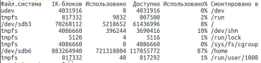
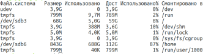
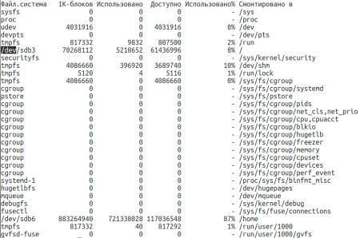

## df utilitasidan foydalanish
df - bu tizim disk maydonidan foydalanish to'g'risida batafsil hisobot olish buyrug'i.

Quyida df buyrug'i bilan ishlashning ba'zi misollari keltirilgan:
- df buyrug'iga oddiy chaqiruv: \
  
- Endi utilitadan -h kaliti yordamida ma'lumotlarni yanada o'qilishi mumkin bo'lgan formatda chiqarishni so'raymiz: \
  
- -a opsiyasini belgilash orqali siz yadroga ma’lum bo’lgan, quyidagicha o’rnatilgan barcha fayl tizimlari haqida ma'lumot olishingiz mumkin: \
  
- -H -- gigabaytdagi barcha o'lchamdagi chiqish kaliti
- -P -- POSIX chiqish formatidan foydalanish kaliti
- -x -- belgilangan fayl tizimlaridan tashqari barcha o'lchamlar haqidagi ma'lumotlarni chiqarish kaliti

