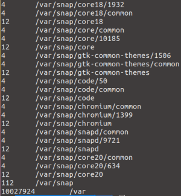
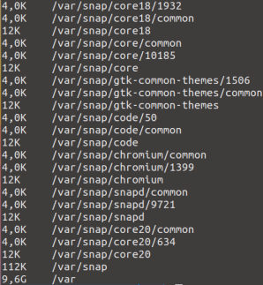
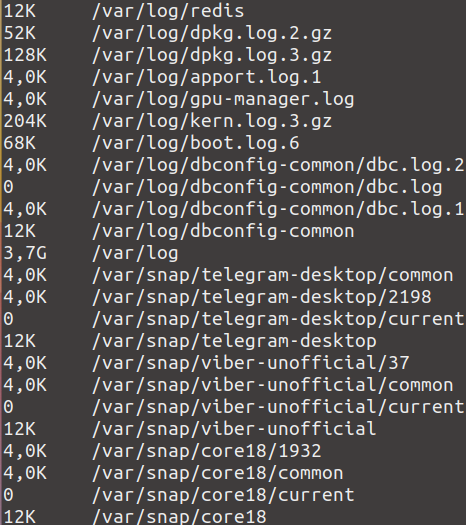

## du utilitasidan foydalanish
du - buyruqni chaqirishda ko'rsatilgan fayllar yoki kataloglar tomonidan ishlatiladigan disk maydonining taxminiy hajmini olish buyrug'i.

du buyrug'i bilan ishlashning ba'zi misollari:
-  Muayyan katalogdagi papkalar ro‘yxatini va ular egallagan joyni shunchaki chiqarish uchun, masalan, /var da, quyidagini bajaring: \
  
- Asl sozlamalar bo’yicha, o'lcham baytlarda chiqariladi. O'lchamni o'qilishi mumkin bo'lgan shaklda ko'rsatish uchun -h opsiyasidan foydalaning: \
  
- Agar nafaqat papkalar, balki u yerda joylashgan fayllar o’lchamini ham chiqarish kerak bo'lsa, -a opsiyasidan foydalaning: \
  
- -c -- barcha papkalarning umumiy hajmi oxiridagi chiqish kaliti
- -d -- direktoriyalarni joylashtirishning maksimal chuqurligi
- -s -- faqat umumiy hajmni chiqarish imkoniyati
