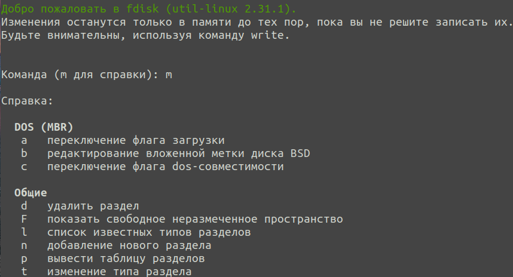
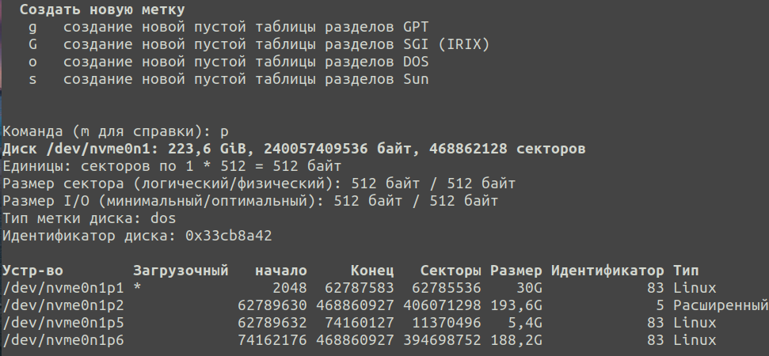

## fdisk utilitasidan foydalanish
Qattiq disklar katta hajmga ega bo'lganligi sababli, ularning maydoni odatda bir nechta qismlarga – disk bo'limlariga bo'linadi va ular bilan tizimdagi mustaqil disklar kabi ishlash mumkin. \
fdisk - qattiq disk bo'limlarini boshqarish va ular haqida ma'lumot olish buyrug'i.

fdisk buyrug'i bilan ishlashning ba'zi misollari quyida keltirilgan:
- Siz uchun mavjud bo'lgan disklar va bo'limlar ro'yxatini ko'rish uchun -l opsiyasidan foydalaning: \
  
- Disk belgilari bo’yicha ko'pgina fdisk operatsiyalari interaktiv rejimda amalga oshiriladi. Interaktiv rejimda fdiskni ishga tushirish uchun belgilanishi kerak bo'lgan blokli qurilmani utilitaga o'tkazing. \
    Ushbu misolda u /dev/nvme0n1: \
  
- Joriy bo'limlar jadvali turini, shuningdek diskdagi mavjud bo'limlarni ko'rish uchun p buyrug'idan foydalaning:\
  
- m -- xotira ma'lumotlarini ko'rsatish rejimini o'chirish yoki o’zgartirish buyrug'i
- w -- diskka yangi bo'limlar jadvalini yozish buyrug'i (mazmunan -- o'zgarishlarni saqlash)
- q -- saqlamasdan chiqish buyrug’i

