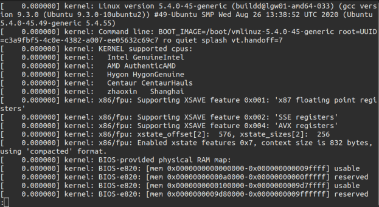
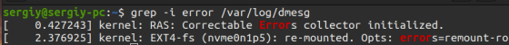

## Tizim jurnallari bilan ishlash
Tizim jurnallari – bu, fayllar, uskunaning ishlashi va shu kabilar bilan sodir bo'luvchi barcha hodisalar va jarayonlarni saqlaydigan fayllar. \
Ko'p miqdordagi tizim jurnallari mavjud bo’lib, ularning barchasi /var/log/ direktoriyasida joylashgan. 

Loglarni ko'rish uchun bir nechta Linux buyruq qatori utilitalaridan foydalanish qulay. Ushbu maqsadlar uchun eng ko'p ishlatiladigan buyruqlar:
- less
- more
- cat
- head
- grep
- tail
- zcat
- zgrep
- zmore
- vi
- nano

Misol sifatida /var/log/dmesg logidan foydalanib, ulardan ba'zilarini ko'rib chiqamiz:
- less — o'tish imkoniyati bilan loglarni ko'rish:
    
- tail — loglarni real vaqtda ko'rish
- cat — log faylini ochish
- head — logning birinchi qatorlarini ko'rish
- grep -i error — logdan faqat xatolarni chiqarish: \
    
