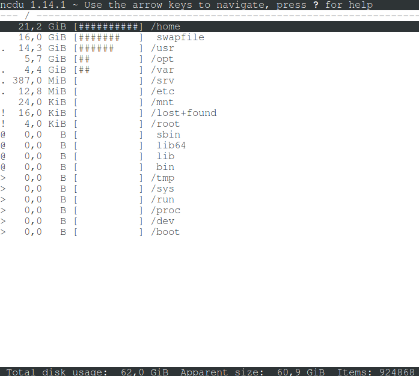

## ncdu utilitasini o'rnatish va foydalanish
ncdu – du bilan bir xil maqsadga ega bo'lgan buyruq, lekin yoqimli va qulay interfeysga ega.

ncdu buyrug'i bilan ishlashning ba'zi misollari quyida keltirilgan:
- Dasturdan foydalanish oddiy. Joriy direktoriyani skanerlash va ko‘rib chiqish uchun ncdu dasturini ishga tushirish kifoya: \
    
- Butun fayl tizimini skanerlash uchun yo'lni ko'rsatish lozim. Ildiz uchun bu slesh. -x opsiyasi – joriy fayl tizimidan tashqariga chiqmaslik ham foydalidir. Gap shundaki, boshqa disklar ildiz fayl tizimiga o'rnatilishi mumkin – va bu variantsiz ular ham hisobga olinadi. ncdu -x / buyrug'ini bajarish: \
    
- Tanlangan direktoriyaga o‘tish uchun quyidagi tugmalardan birini ishlating:
    - kursor o'ngga
    - ENTER 
    - l
- Asosiy direktoriyaga qaytish uchun quyidagi tugmalardan birini ishlating:
    - kursor chapga
    - <
    - h
- Quyidagi tugmalar direktoriya va fayllarni saralash uchun ishlatiladi (teskari tartiblash uchun yana bir marta bosing):
- n - fayl nomi bo'yicha
- s - fayl hajmi bo'yicha
- C - elementlar soni bo'yicha
- M - oxirgi tarmoqlangan elementni o'zgartirish vaqti bo'yicha
