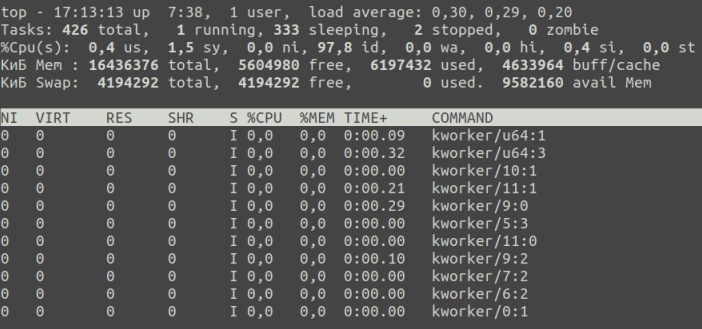
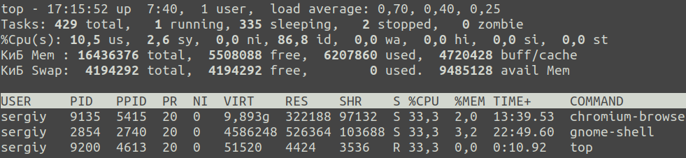
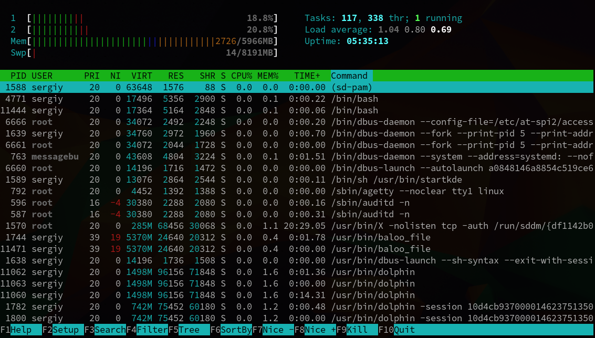
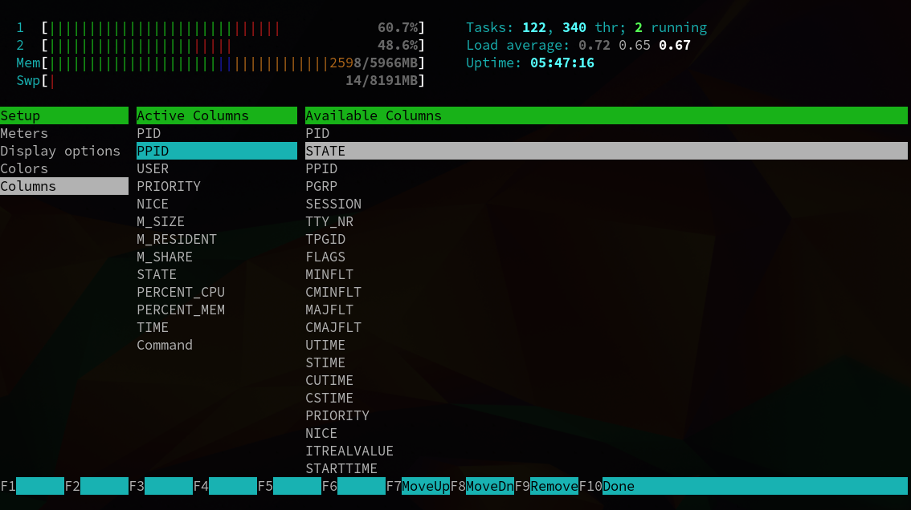
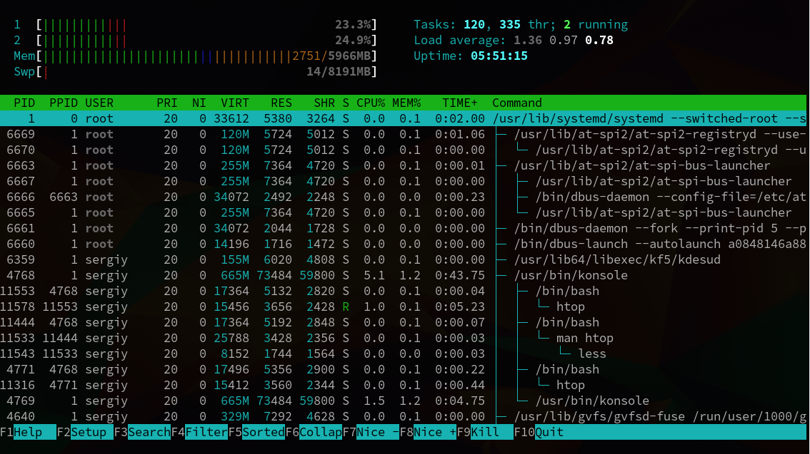

# top buyrug’i
top buyrug’i Linuxda ishga tushirilgan dasturlar va xizmatlar jarayonlarini, tizim resurslari iste'moli haqidagi ma'lumotlarni ko'rsatadi va jarayonlarni qidirish, to'xtatish va boshqarish imkonini beradi. 

top buyrug’i bilan ishlashning ba'zi misollari quyida keltirilgan:
- Oyna shartli ravishda ikki qismga bo‘linishi mumkin. Yuqori qismida tizim, protsessor va xotira resurslaridan umumiy foydalanish, chiqarish bo'limi va shu kabilar haqida ma'lumot mavjud. Oynaning pastki qismida ma'lum bir maydon bo'yicha tartiblangan ma'lumotlarga ega ishga tushirilgan jarayonlar ro'yxati mavjud.
  
- Agar siz faqat protsessor resurslaridan foydalanadigan jarayonlarni aks ettirishni istasangiz, i buyrug'idan foydalaning:
  
- Hozir saralayotgan maydonni belgilash uchun x klavishini bosing. Shundan so'ng, butun ustun qalin shrift bilan belgilanadi:
  
- m -- xotira ma'lumotlarini aks ettirish rejimini o'chirish yoki o’zgartirish buyrug'i
- F -- jarayonlar haqidagi ma'lumotlarga ega maydonlarni sozlash buyrug'i
- L -- so‘z bo’yicha qidirish buyrug‘i

## htop buyrug'i
htop buyrug'i taxminan **top** bilan bir xil vazifani bajaradi, lekin ma'lum afzalliklarga va kamchiliklarga ega: qulayroq qidirish va filtrlash, lekin jarayonlarni aks ettirish uchun kamroq moslashuvchan sozlamalar.

htop buyrug'i bilan ishlashning ba'zi misollari quyida keltirilgan:
- htop ochilganida, darhol ishga tushirilgan jarayonlar ro'yxatini ko’rish mumkin. Albatta, bu yerda barcha Linux jarayonlari ham ko'rsatilmagan. Asl sozlamalar bo’yicha, foydalanuvchingiz nomidan ishga tushirilgan jarayonlar chiqariladi: \
  
- Setup menyusi yordamida aks ettirishga qo'shimcha parametrlarni ham qo'shish mumkin. U yerda hamma narsa juda oddiy, maslahatlarni o'qing va ko'rsatmalarga amal qiling. Masalan, PPID parametri qo'shildi: \
  
- Daraxt shaklida jarayonlarni tartibga solishning qiziqarli imkoniyati ham mavjud. Muayyan jarayon qaysi jarayon bilan boshlanganini ko'rishingiz mumkin. Daraxtni aks ettirish uchun F5 tugmasini bosing: \
  
