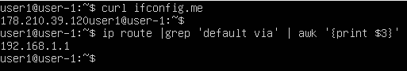
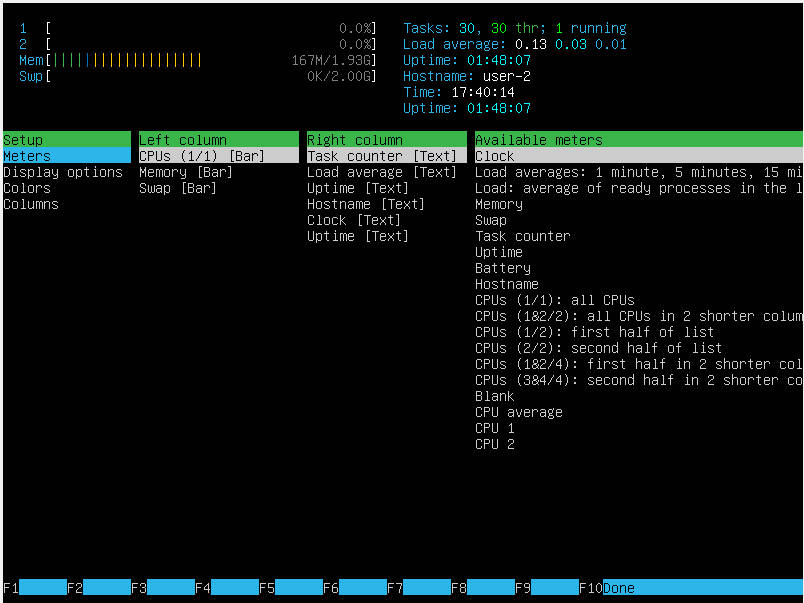
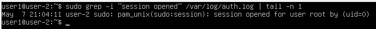

## Part 1. Установка ОС

- Установили Ubuntu 20.04 Server LTS без графического интерфейса, используя программу для виртуализации — VirtualBox
- Проверили версию системы командой `cat /etc/issue`:
  
    
  *Рис. 1. Результат выполнения команды `cat /etc/issue`*

## Part 2. Создание пользователя

- Создали пользователя, отличного от созданного при установке. Добавили пользователя в группу **adm**
- Создали пользователя командой `sudo adduser user2`, и добавили его в группу командой `sudo usermod -a -G adm user2`:

  
  
  *Рис. 1. Результат выполнения команд `sudo adduser user2` и `sudo usermod -a -G adm user2`*

- Проверили наличие нового пользователя командой `cat /etc/passwd`:

  

  *Рис. 2. Результат выполнения команды `cat /etc/passwd`*

## Part 3. Настройка сети ОС

- Задал название машины вида **user-1**, используя команду `sudo hostnamectl set-hostname user-1` и вывел на экран название машины командой `hostname`:

  

  *Рис. 1. Результат выполнения команд `sudo hostnamectl set-hostname user-1` и `hostname`*

- Установил временную зону, соответствующую моему текущему местоположению. Используя команду `timedatectl list-timezones` можно получить список доступных временных зон, 
используя команду `timedatectl set-timezone Europe/Moscow` установил нужную временную зону, используя команду `timedatectl` проверил текущую дату и часовой пояс.

  

  *Рис. 2. Результат выполнения команд `timedatectl set-timezone Europe/Moscow` и `timedatectl`*

- Вывел названия сетевых интерфейсов с помощью консольной команды `ip link show`

  

  *Рис. 3. Результат выполнения команды `ip link show`*

  - lo (loopback) - виртуальный сетевой интерфейс. Его используют для подключения приложений и процессов на одном компьютере к другим приложениям и процессам. Во многих операционных системах он обозначается как адаптер lo с IP-адресом 127.0.0.1.

- Используя консольную команду `hostname -I`, получил ip адрес устройства, от DHCP-сервера.

  

  *Рис. 4. Результат выполнения команды `hostname -I`*

  - DHCP (Dynamic Host Configuration Protocol — протокол динамической настройки узла) — сетевой протокол, позволяющий сетевым устройствам автоматически получать IP-адрес и другие параметры, необходимые для работы в сети TCP/IP.

- Используя команду `curl ifconfig.me` получил внешний ip-адрес шлюза, используя команду `ip route | grep 'default via' | awk '{print $3}'` получил внутренний IP-адрес шлюза

  

  *Рис. 5. Результат выполнения команд `curl ifconfig.me` и `ip route | grep 'default via' | awk '{print $3}`*

- Чтобы задать статичные настройки ip, gw, dns необходимо отредоктировать файл `/etc/netplan/00-installer-config.yaml` открыв его командой `sudo nano /etc/netplan/00-installer-config.yaml`.   
В нем необходимо ввести данные настройки:  
  ```yaml
  network:
    version: 2
    ethernets:
      enp0s3:
        dhcp4: no
        addresses: [192.168.1.100/24]
        gateway4: 192.168.1.1
        nameservers:
          addresses: [1.1.1.1, 8.8.8.8]
  ```  
  После редактирования файла необходимо выполнить команду `sudo netplan apply`, чтобы применить изменения 

  

  *Рис. 6. Результат выполнения команд `sudo nano /etc/netplan/00-installer-config.yaml` и `sudo netplan apply`*

- Перезагрузил виртуальную машину. Убедился, что статичные сетевые настройки (ip, gw, dns) соответствуют заданным в предыдущем пункте. Пропинговал удаленные хосты 1.1.1.1 и ya.ru командами 
`ping -c 10 1.1.1.1` и `ping -c 10 ya.ru`. При вызове обоих команд была фраза **«0% packet loss»**.

  

  *Рис. 7. Результат выполнения команд `ping -c 10 1.1.1.1` и `ping -c 10 ya.ru`

## Part 4. Обновление ОС

- Обновил системные пакеты до последней на момент выполнения задания версии, используя команды `sudo apt update` и `sudo apt upgrade`.

  

  *Рис. 1. Результат выполнения команд `sudo apt update` и `sudo apt upgrade`

  При повторном вызове команды `sudo apt upgrade` видим сообщение о том, что обновления отсутствуют

  

  *Рис. 2. Результат повтороного вызова команды `sudo apt upgrade`

## Part 5. Использование команды sudo

- Разрешил пользователю, созданному в Part 2, выполнять команду sudo, командой `sudo usermod -aG sudo user2`.

  

  *Рис. 1. Результат выполнения команды `sudo usermod -aG sudo user2`

  - Команда sudo может использоваться для выполнения пользователем какой-либо команды, требующей права суперпользователя (root), то есть получение прав root для выполнения какой-либо команды на время её выполнения. 

- Поменял hostname ОС от имени пользователя, созданного в пункте Part 2, командой `su - user2 -c "sudo -S hostnamectl set-hostname user-2"`, командой `hostname` убидился в смене hostname ОС

  

  *Рис. 2. Результат выполнения команд `su - user2 -c "sudo -S hostnamectl set-hostname user-2"` и `hostname`

## Part 6. Установка и настройка службы времени

- Настроил службу автоматической синхронизации времени командой `sudo timedatectl set-ntp true`, вывел время часового пояса командой `timedatectl`. Вывод команды `timedatectl show` содержит 
строку **NTPSynchronized=yes**

  

  *Рис. 1. Результат выполнения команд `sudo timedatectl set-ntp true`, `timedatectl` и `timedatectl show`

## Part 7. Установка и использование текстовых редакторов

- Установил текстовые редакторы **VIM**, **NANO**, **JOE**. Создал файлы **test_VIM.txt**, **test_NANO.txt**, **test_JOE.txt**

  

  *Рис. 1. Созданные файлы

- Чтобы открыть файл для редактирования в **VIM** необходимо выполнить команду `vim test_VIM.txt`, далее необходимо нажать клавишу **i** для перехода в режим **Insert**, после ввода текста необходимо нажать комбинацию клавиш **ctrl + [** или **Esc**, затем нажать клавишу **:** для перехода в режим консоли, и написать **wq** чтобы сохранить изменения в файле

  

  *Рис. 2. Отредоктированный файл перед закрытием, в VIM

- Чтобы открыть файл для редактирования в **NANO** необходимо выполнить команду `nano test_VIM.txt`, далее вводим текст, нажав **ctrl + x** можно выйти из файла, перед выходом редактор спросит хотим ли мы сохранить изменения или нет, нажимем **y** для сохранения.

  

  *Рис. 3. Отредоктированный файл перед закрытием, в NANO

- Чтобы открыть файл для редактирования в **JOE** необходимо выполнить команду `joe test_VIM.txt`, далее вводим текст, нажав **ctrl + k + x** можно выйти из файла сохранив изменения

  

  *Рис. 4. Отредоктированный файл перед закрытием, в JOE

- Чтобы выйти из **VIM** без сохранения изменений необходимо нажать **:**, затем **q!**

  

  *Рис. 5. Отредоктированный файл перед закрытием без изменений, в VIM

- Чтобы выйти из **NANO** без сохранения изменений необходимо нажать **ctrl + x**, затем **n**

  

  *Рис. 6. Отредоктированный файл перед закрытием без изменений, в NANO

- Чтобы выйти из **JOE** без сохранения изменений необходимо нажать **ctrl + k + q**, затем **n**

  

  *Рис. 7. Отредоктированный файл перед закрытием без изменений, в JOE

- Чтобы найти слово в редакторе **VIM** необходимо выполнить команду `/test` для поиска слова **test** вперед, или `?test` для поиска слова назад

  

  *Рис. 8. Результат поиска слова **test**

- Чтобы заменить слово одно на другое во всем файле необходимо выполнить команду `%s/old/new/g`, где **old** слово которое хотим заменить, **new** слово на которое хотим заменить. Для замены всех вхождений слова в текущей строке нужно выполнить команду `s/old/new/g`

  

  *Рис. 9. Результат замены слова **test** на **kingsbla** командой `%s/test/kingsbla/g` 

- Чтобы найти слово в редакторе **NANO** необходимо нажать сочетание клавиш **ctrl + w**, ввести слово для поиска и нажать **Enter**

  

  *Рис. 10. Результат поиска слова **test**

- Чтобы заменить слово одно на другое необходимо нажать сочетание клавиш **ctrl + \ **, ввести слово для замены и нажать **enter**, затем ввести новое слово и нажать **enter**, далее выбрать действие: **Y** - заменить текущее вхождение, или **A** - заменить все вхождения, или **N** - пропустить

  

  *Рис. 11. Результат замены слова **test** на **kingsbla**

- Чтобы найти слово в редакторе **JOE** необходимо нажать сочетание клавиш **ctrl + k + f**, ввести слово для поиска и нажать **Enter**, далее нажать **i** для поиска текста

  

  *Рис. 12. Результат поиска слова **test**

- Чтобы заменить слово не необходимо нажать сочетание клавиш **ctrl + k + f**, ввести слово для поиска и нажать **Enter**, далее нажать **r** для замены текста, ввести новое слово нажать **Enter**, и нажать **y** для подтверждения или **n** для отмены

  

  *Рис. 13. Результат замены слова **test** на **kingsbla**

## Part 8. Установка и базовая настройка сервиса SSHD

- Установил службу SSHd командой `sudo apt install openssh-server`, проверил работу SSH, командой `systemctl status sshd` 

  

  *Рис. 1. Результат установки SSHD, и проверки его работы

- Добавил автостарт службы при загрузке системы командой `sudo systemctl enable ssh`

  

  *Рис. 2. Результат выполнения команды `sudo systemctl enable ssh`

- Перенастроил службу SSHd на порт 2022. Для этого через редактор nano открыл файл **/etc/ssh/sshd_config**. Раскоментировал строку **Port** убрав **#** в начале, и заменил **22** на **2022**

  

  *Рис. 3. Результат изменения значения **Port**  

  Перезагрузил систему командой `sudo systemctl restart sshd`, командой `sudo systemctl status sshd`, убедился в том что **Port 2022**

    

    *Рис. 4. Результат выполнения команд `sudo systemctl restart sshd` и `sudo systemctl status sshd`

- Используя команду `ps -e | grep sshd`, показал наличие процесса sshd. **ps** выводит отчет о работающих процессах, флаг **-e**  нужен для того чтобы выбрать все процессы, **|** - пайплайн, он нужен для того чтобы одной командой выполнять сразу несколько действий, **grep** -программа для поиска текста, **sshd** паттерн по которому идет поиск

  

  *Рис. 5. Результат выполнения команды `ps -e | grep sshd`

- Перезагрузил систему, выполнил команду `netstat -tan`, увидел строку `tcp 0 0 0.0.0.0:2022 0.0.0.0:* LISTEN`.  
`-t` - отображать только TCP-соединения  
`-a` - показывать все соединения (как активные, так и ожидающие)  
`-n` - не преобразовывать IP-адреса и порты в имена (вывод в числовом формате)  
`Proto` - протокол  
`Recv-Q` - количество данных, полученных программой, но ещё не прочитанных (в байтах)  
`Send-Q` - количество данных, отправленных, но ещё не подтверждённых удалённой стороной (в байтах)  
`Local Address` - локальный IP-адрес и порт в формате IP:PORT  
`Foreign Address` - удалённый IP-адрес и порт  
`State` - текущее состояние TCP-соединения  
`0.0.0.0` - означает, что сервис принимает подключения со всех доступных сетевых интерфейсов (всех IP-адресов компьютера)  

  

  *Рис. 6. Результат выполнения команды `netstat -tan`

## Part 9. Установка и использование утилит top, htop

- Чтобы установить утилиты **top** и **htop**, выполним команду `sudo apt install top htop`  
По выводу команды **top** определил:  
`uptime` - 37 min  
`количество авторизованных пользователей` - 1 user  
`средняя загрузка системы` - 0.00, 0.00, 0.00  
`общее количество процессов` - 107 total  
`загрузка cpu` - 0.0 us    
`загрузка памяти` - 163.8 used, 719.0 buff/cache  
`pid процесса занимающего больше всего памяти` - 688  
`pid процесса, занимающего больше всего процессорного времени` - 572  

  
  
  *Рис. 1. Результат выполнения команды `top`

- Выводы команды **htop**:  

  

  *Рис. 2. Сортировка по PID

  

  *Рис. 3. Сортировка по PERCENT_CPU

  

  *Рис. 4. Сортировка по PERCENT_MEM

  

  *Рис. 5. Сортировка по TIME

  

  *Рис. 6. Отфильтрованно для процесса **sshd**

  

  *Рис. 7. Процесс **syslog**, найденный, используя поиск

  

  *Рис. 8. Добавленный вывод **hostname**, **clock**, **uptime**

## Part 10. Использование утилиты fdisk

- Запустил команду `fdisk -l`  
`название жесткого диска` - VBOX HARDDISK  
`размер` - 25 GiB  
`количество секторов` - 52428800 sectors   

  

  *Рис. 1. Результат выполнения команды `fdisk -l`  

  Чтобы узнать размер **swap**, выполним команду `swapon --show`  
  `размер swap` - 2G

    

    *Рис. 2. Результат выполнения команды `swapon --show` 

## Part 11. Использование утилиты df

- Используя команду `df /`, узнаем информацию о жестком диске для для корневого раздела **/**  
`размер раздела` - 11758760  
`размер занятого пространства` - 5079632  
`размер свободного пространства` - 6060020  
`процент использования` - 46%  
Единицы измирения: размер раздела, размер занятого пространства, размер свободного пространства - Кб (Килобайты), процент использования - проценты  

  

  *Рис. 1. Результат выполнения команды `df /` 

- Используя команду `df -Th /`, узнаем информацию о жестком диске для для корневого раздела **/**  
`размер раздела` - 12G  
`размер занятого пространства` - 4.9G  
`размер свободного пространства` - 5.8G  
`процент использования` - 46%  
Единицы измирения: размер раздела, размер занятого пространства, размер свободного пространства - Гб(Гигобайты), процент использования - проценты  
`Тип файловой системы` - ext4

  

  *Рис. 2. Результат выполнения команды `df -Th /` 

## Part 12. Использование утилиты du

- Выполнил команду `du`

  

  *Рис. 1. Результат выполнения команды `du`

- Вывел размер папок /home, /var, /var/log (в байтах, в человекочитаемом виде), командами `sudo du -sbh /home`, `sudo du -sbh /var`, `sudo du -sbh /var/log`

  

  *Рис. 2. Результат выполнения команд `sudo du -sbh /home`, `sudo du -sbh /var`, `sudo du -sbh /var/log`

- Вывел размер всего содержимого в /var/log используя *****, командой `sudo du -sh /var/log/*`

  

  *Рис. 3. Результат выполнения команды `sudo du -sh /var/log/*`

## Part 13. Установка и использование утилиты ncdu

- Установил утилиту **ncdu** командой `sudo apt install ncdu`, и убедился в установке командой `command -v ncdu`

  

  *Рис. 1. Результат выполнения команд `sudo apt install ncdu` и `command -v ncdu`

- Вывел размер папок /home, /var, /var/log

  

  *Рис. 2. размер **/home**

  

  *Рис. 3. размер **/var**

  

  *Рис. 4. размер **/var/log**

## Part 14. Работа с системными журналами

- Открыл для просмтора файлы **/var/log/dmesg**, **/var/log/syslog**, **/var/log/auth.log**. Командами `sudo less /var/log/dmesg`, `sudo less /var/log/syslog`, `sudo less /var/log/auth.log`

  

  *Рис. 1. Результат выполнения команды `sudo less /var/log/dmesg`

  

  *Рис. 2. Результат выполнения команды `sudo less /var/log/syslog`

  

  *Рис. 3. Результат выполнения команды `sudo less /var/log/auth.log`

- Вывел время последней успешной авторизации, имя пользователя и метод входа в систему, командой `sudo grep -i "session opened" /var/log/auth.log | tail -n 1`

  

  *Рис. 4. Результат выполнения команды `sudo tail -n 1 /var/log/auth.log | grep "logged in"`

- Перезапустил службу SSHd, командой `sudo systemctl restart sshd`

  

  *Рис. 5. Результат выполнения команды `sudo systemctl restart sshd`

- Вывел сообщение о рестарте службы командой, `sudo grep -i "restart" /var/log/auth.log | tail -n 1`

  

  *Рис. 6. Результат выполнения команды `sudo grep -i "restart" /var/log/auth.log | tail -n 1`

## Part 15. Использование планировщика заданий CRON

- Открыл редактор командой `crontab -e`. Добавил новую задачу командой `*/2 * * * * /usr/bin/uptime >> /var/log/uptime.log`. Часть `>> /var/log/uptime.log` необходима для записи логов

  

  *Рис. 1. Новая задача добавленная через планировщик CRON

- Используя команду `sudo grep CRON /var/log/syslog` получил логи о выполнении команд

  

  *Рис. 2. Результат выполнения команды `sudo grep CRON /var/log/syslog`

- Вывел список текущих задач **CRON** командой `crontab -l`

  

  *Рис. 3. Результат выполнения команды `crontab -l`

- Удалили все задания из планировщика командой `crontab -r`, командой `crontab -l`, проверил что задачи отсутсвуют

  

  *Рис. 4. Результат выполнения команд `crontab -r` и `crontab -l`