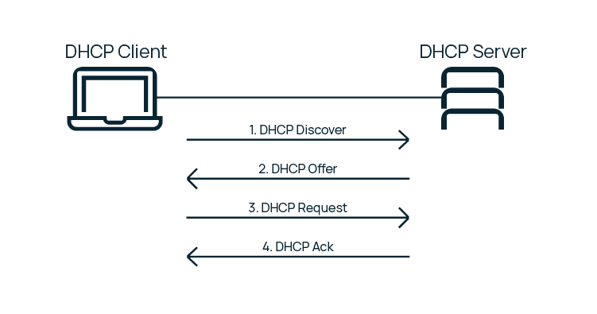

## **DHCP** protokoli

**DHCP** – TCP/IP modelining amaliy darajasi protokoli bo'lib, mijozga IP-manzilni tayinlash uchun xizmat qiladi. IP-manzil har bir mijozga, ya'ni mahalliy tarmoqdagi kompyuterga qo'lda tayinlanishi mumkin. Ammo yirik tarmoqlarda bu juda ko'p mehnat talab qiladi va mahalliy tarmoq qanchalik katta bo'lsa, sozlash paytida xatolar ehtimoli shunchalik yuqori bo'ladi. Shuning uchun **DHCP** protokoli IP tayinlashni avtomatlashtirish uchun yaratilgan.

Manzilni olish to'rt bosqichda amalga oshiriladi. Bu jarayon har bir qadamning birinchi harfidan olinib, *DORA* deb ataladi:
- **Discovery** (Aniqlash),
- **Offer** (Taklif),
- **Request** (So’rov),
- **Acknowledgement** (Tasdiqlash).



### **DHCP** opsiyalari

Tarmoqda ishlash uchun mijozga nafaqat IP, balki boshqa **DHCP** parametrlari ham talab qilinadi: masalan, quyi tarmoq maskasi, asosiy shlyuz va server manzili. Opsiyalar – bu raqamlangan bandlar bo‘lib, server mijozi tomonidan talab qilinadigan konfiguratsiya parametrlarini o'z ichiga oluvchi ma'lumotlar qatorlari hisoblanadi.

Ba'zi opsiyalarni tavsiflab o’tamiz:
- **Option 1** — IP quyi tarmoq maskasi;
- **Option 3** – asosiy shlyuz;
- **Option 6** — DNS server manzili (asosiy va zaxira);
- **Option 51** — IP-manzil mijozga qancha muddatga ijaraga berilishini belgilaydi;
- **Option 55** — so‘raluvchi opsiyalar ro‘yxati. Mijoz har doim to'g'ri konfiguratsiya uchun opsiyalar so‘raydi. **Option 55** bilan xabar yuborayotganda, mijoz so‘raluvchi sonli opsiya kodlari ro'yxatini afzal ko'rish tartibida taqdim etadi. **DHCP** serveri javobni opsiyalar bilan bir xil tartibda yuborishga harakat qiladi.

## **DHCP** mijozi (**dhclient**) tomonidan IP-manzilni majburiy yangilash

IP manzilini majburiy yangilash uchun mijoz **dhclient** buyrug'i yordamida Dinamik Uzel Sozlamasi Protokolidan foydalanishi kerak. Odatda, mijozning o'zi manzil ijarasini to'xtatmaydi, chunki **DHCP** protokoli buni talab qilmaydi. Biroq, ba'zi Internet-provayderlar o'z mijozlaridan tayinlangan IP-manzilni bo’shatishni xohlaganlarida serverni xabardor qilishni talab qilishlari mumkin.

**dhclient** buyrug'i **DHCP** yoki **BOOTP** protokoli yordamida bir yoki bir nechta tarmoq interfeyslarini sozlash imkonini beradi. Agar ushbu protokollar ishlamasa, u holda manzil statik ravishda tayinlanadi.

*Ogohlantirish: IP-manzilni bo’shatish har doim tarmoq interfeysi/WiFi ishlamay qolishiga olib keladi, shuning uchun uni masofaviy tizimlarda ishlatganda ehtiyot bo'ling.*

**-r** bayrog'i manzilni aniq bo’shatadi va shundan so’ng mijoz ishni yakunlaydi. Masalan, terminalni ochamiz va buyruqni kiritamiz:
```shell
$ sudo dhclient -r
```

Keyin **Linux**da **DHCP**-dan foydalanib, yangi IP-manzil olish mumkin:
```shell
$ sudo dhclient
```

Ma'lum bir interfeys uchun IP-manzilni yangilash yoki bo’shatish uchun, masalan **eth0**, quyidagi buyruqlarni kiritish mumkin:
```shell
$ sudo dhclient -r eth0
$ sudo dhclient eth0
```