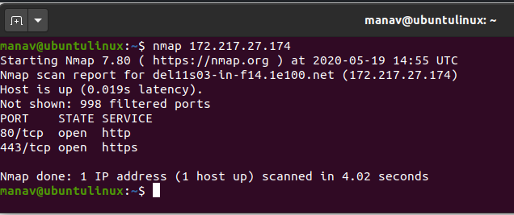

## **iptables**

**iptables** – tarmoqlararo ekran buyruq qatori utilitasi bo'lib, u trafikka ruxsat berish yoki blokirovka qilish uchun policy zanjirlaridan foydalanadi. 
Tizimingizga ulanishga harakat qilganingizda, **iptables** o'z ro'yxatida unga mos keladigan qoidani qidiradi. Agar utilita uni topa olmasa, u asl sozlamalar bo’yicha amalga murojaat qiladi.

## **nmap**

**nmap** – bu tarmoqni o'rganish va xavfsizlikni tekshirish uchun **Linux** buyruq qatori vositasi.
Odatda xakerlar va kiberxavfsizlik fanatlari, shuningdek, tarmoq va tizim administratorlari orasida mashhur.
U quyidagi maqsadlarda qo'llaniladi:
- Real vaqt rejimida tarmoq haqida ma'lumot olish;
- Tarmog'ingizda faollashtirilgan barcha **IP** manzillar haqida batafsil ma'lumot olish;
- Tarmoqdagi ochiq portlar soni haqida ma'lumot olish;
- Jonli xostlar ro'yxatini taqdim etish;
- Portlar, **OS** va xostlarni skanerlash.

Ko'pincha **nmap** tizimni xost nomi yoki **IP** manzili bo'yicha skanerlash uchun kerak bo'ladi.
Quyida **IP**-manzil yordamida skanerlash misoli keltirilgan:

**nmap**-ning o'ziga xos jihati shundaki, ushbu utilita uni pinglash mumkin bo'lmasa ham, hostning yoqilgan yoki yo’qligini aniqlashi mumkin.