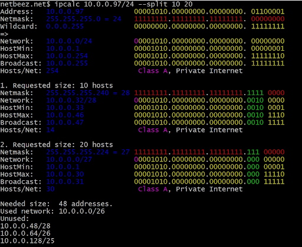

## **Manzillash. Davomi**

#### **IP manzillarning tasnifi**

IP manzillar "xususiy" va "ommaviy" ga bo'linadi. Quyidagi manzil diapazonlari xususiy (mahalliy tarmoqlar) uchun ajratilgan:
- *10.0.0.0* — *10.255.255.255* (*10.0.0.0/8*);
- *172.16.0.0* — *172.31.255.255* (*172.16.0.0/12*);
- *192.168.0.0* — *192.168.255.255* (*192.168.0.0/16*);
- *127.0.0.0* — *127.255.255.255* (localhost deb ataluvchi halqa interfeyslari uchun ajratilgan (tarmoq uzellari o'rtasida almashish uchun foydalanilmaydi)).

#### **Portlar**

**TCP** va **UDP** protokollarining har biri uchun standart bir vaqtning o'zida xostda 0 dan 65535 gacha raqamlar bilan aniqlangan 65536 tagacha noyob portlarni ajratish imkoniyatini belgilaydi.
Portlarning butun diapazoni 3 guruhga bo'linadi:
- **0** dan **1023** gacha – imtiyozli yoki zahiralangan portlar (tizimli va ba'zi mashhur dasturlarda qo'llaniladi);
- **1024** – **49151** – ro'yxatga olingan portlar;
- **49152** – **65535** – dinamik portlar.

## **ipcalc**

**ipcalc** – bu **IPv4** manzillarida oddiy operatsiyalarni bajarishga imkon beruvchi utilita. Agar **ipcalc** hech qanday kiritish parametrlarisiz yozilsa, ekranda ishni boshlash uchun juda foydali bo'lgan misollarga ega "ma’lumotnoma" paydo bo'ladi.

#### **ipcalc dan foydalanishga misollar**

Misollarni ko'rib chiqamiz. Agar siz xostingizning **IPv4** manzilini kiruvchi ma’lumot sifatida belgilasangiz, quyidagi natijaga erishasiz:

**ipcalc** o'zi xostning tarmoq maskasini tanlaydi va natija juda tushunarli bo’ladi. **ipcalc** ning afzalligi shundaki, u har bir manzil uchun ikkilik ekvivalenti hosil qiladi.

Ikkilik ko'rinishdagi probel manzilning tarmoq va xost qismlarini ajratib turadi.

Kirish parametri sifatida tarmoq maskasini ham berish mumkin. Masalan:

Afsuski, manzilning ikkilik shaklini **ipcalc** kirishga o'tkazib bo'lmaydi :(

##### **Quyi tarmoqlar**

**ipcalc** ning eng foydali funksiyalaridan biri tarmoq segmentlarini hisoblashdir. Quyida ikkita turli quyi tarmoqqa **10** va **20** manzillarni belgilashda bu qanday ishlashiga misol keltirilgan:

