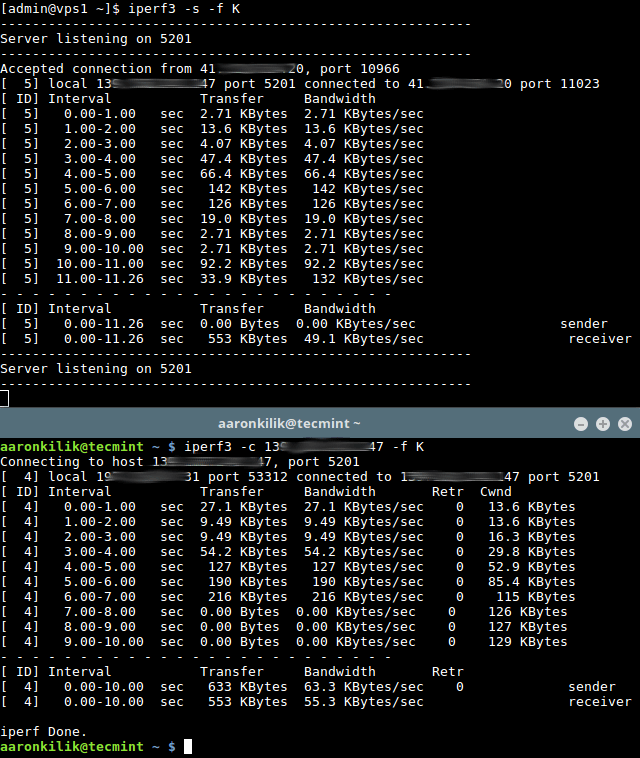

## **Ulanish tezligi**

Axborot uzatish tezligining asosiy o’lchov birligi soniyasiga bitlar hisoblanadi (**bps**).

Bir soniyadagi bayt (**B/s**) va **bit/s** o'rtasidagi farq baytlar va bitlar orasidagi farq bilan bir xil: 
**1 B/s = 8 bit/s**.

Xuddi shunday, soniyasiga kilobaytlar (**KB/s**) va **B/s** o'rtasidagi farq kilobaytlar va baytlar orasidagi farq bilan bir xil: 
**1 KB/s = 1024 B/s** va hokazo.

## **iperf3**

**iperf3** – real vaqt rejimida tarmoq o'tkazuvchanligini o'lchash dasturidir. 
Bu **IP** tarmoqlarida maksimal erishish mumkin bo'lgan o'tkazuvchanlikni sinab ko'rish vositalaridan biri hisoblanadi (**IPv4** va **IPv6** ni qo'llab-quvvatlaydi).

Tarmoq o'tkazuvchanligini tekshirish uchun avval siz server sifatida foydalanadigan masofaviy mashinaga ulanishingiz va **iperf3**-ni server rejimida **-s** bayrog'i yordamida ishga tushirishingiz kerak. 
Asl sozlamalar bo’yicha, u **5201** portni tinglaydi.

Quyida ko'rsatilgandek **-f** o’zgartirgichi yordamida hisobot formatini (*Kbit, Mbit, Gbit uchun k, m, g yoki Kbayt, Mbayt, Gbayt uchun K, M, G*) ko’rsatishingiz mumkin: 
```iperf3 -s -f K```

Siz ixtiyoriy ravishda **-D** bayrog'i yordamida serverni demon sifatida ishga tushirishingiz va quyidagi misolda bo'lgani kabi server xabarlarini jurnal fayliga yozishingiz mumkin: 
```iperf3 -s -D > iperf3log```

Shundan so’ng, biz mijoz sifatida qabul qiladigan mahalliy mashinada (aslida unda benchmarking amalga oshiriladi), **iperf3**-ni mijoz rejimida **-c** bayrog'i yordamida ishga tushiramiz va server ishlayotgan xostni ko'rsatamiz (biz uning **IP** manzilidan, domenidan yoki xost nomidan foydalanamiz): 
```iperf3 -c 192.168.10.1 -f K```

Taxminan **18-20** soniyadan so'ng, mijoz yakunlashi va quyidagi skrinshotda ko'rsatilganidek, benchmarkning o'rtacha o'tkazuvchanligini ko'rsatadigan natijalarni berishi kerak:



Muhim: Yuqoridagi natijalarga asoslanib, server va mijozdagi qiymatlar farq qiladi. 
Biroq, har bir test **iperf3** mijoz mashinasida olingan natijalarga asoslanishi kerak.