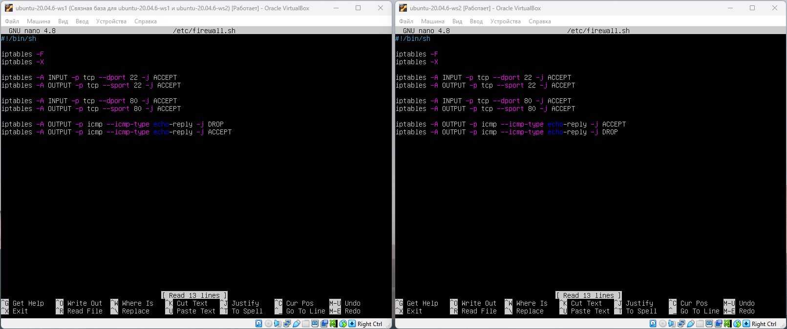
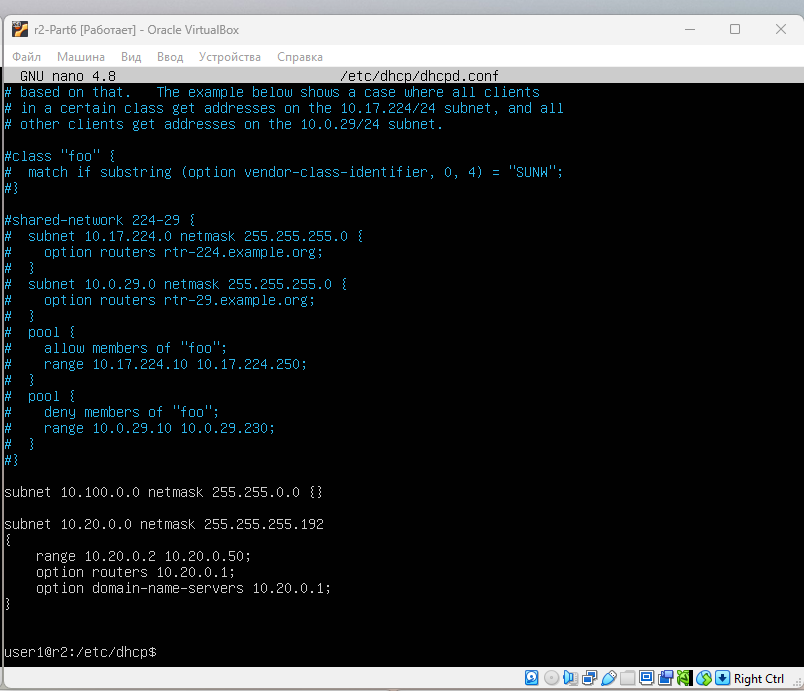
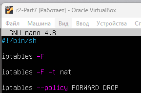

## Part 1. Инструмент ipcalc ##

### 1.1. Сети и маски ###

1. Адрес сети `192.167.38.54/13` - `192.160.0.0`

      
    *Рис. 1. Результат выполнения команды `ipcalc 192.167.38.54/13`*

2. Переводы значений масок:  

    - Перевод маски `255.255.255.0` в префиксную и двоичную запись:  
        - Префиксная - `/24`  
        - Двоичная - `11111111.11111111.11111111.00000000`  
    - Перевод маски `/15` в обычную и двоичную запись:  
        - Обычная - `255.254.0.0`  
        - Двоичная - `11111111.11111110.00000000.00000000`  
    - Перевод маски `11111111.11111111.11111111.11110000` в обычную и префиксную запись:
        - Обычная - `255.255.255.240`  
        - Префиксная - `/28`

      
    *Рис. 2. Результат выполнения команд `ipcalc 255.255.255.0`, `ipcalc /15`, `ipcalc 11111111.11111111.11111111.11110000`*

3. Определил минимальный и максимальный хост в сети `12.167.38.4` при масках:

    - `/8`:
        - Минимальный - `12.0.0.1`
        - Максимальный - `12.255.255.254`
    - `11111111.11111111.00000000.00000000`:
        - Минимальный - `12.167.0.1`
        - Максимальный - `12.167.255.254`
    - `255.255.254.0`:
        - Минимальный - `12.167.38.1`
        - Максимальный - `12.167.39.254`
    - `/4`:
        - Минимальный - `0.0.0.1`
        - Максимальный - `15.255.255.254`

      
    *Рис. 3. Результат выполнения команды `ipcalc 12.167.38.4/8`*

      
    *Рис. 4. Результат выполнения команды `ipcalc 12.167.38.4/16`*

      
    *Рис. 5. Результат выполнения команды `ipcalc 12.167.38.4/23`*

      
    *Рис. 6. Результат выполнения команды `ipcalc 12.167.38.4/4`*

### 1.2. localhost ###

- К приложению, работающему на localhost с адресами: **127.0.0.2** и **127.1.0.1** можно обратиться т.к. они входят в диапазон loopback-адресов 127.0.0.0/8, предназначенных для обращения к localhost

### 1.3. Диапазоны и сегменты сетей ###

1. Определил какие IP можно использовать в качестве публичных, а какие только в качестве частных:

    - Публичные - `134.43.0.2`, `172.0.2.1`, `172.68.0.2`, `192.169.168.1`, `192.172.0.1`
    - Частные - `10.0.0.45`, `192.168.4.2`, `172.20.250.4`, `172.16.255.255`, `10.10.10.10`

2. IP-адреса шлюза возможне у сети **10.10.0.0/18**: `10.10.0.2`, `10.10.10.10`, `10.10.1.255`

## Part 2. Статическая маршрутизация между двумя машинами ##

- Поднял две виртуальные машины. С помощью команды `ip a`, вывел существующие сетевые интерфейсы

      
    *Рис. 1. Результат выполнения команды `ip a`*

- У обоих машин сетефой интерфейс - `enp0s3`. Командой `sudo nano etc/netplan/00-installer-config.yaml` открыл файл для редактирования. Задал следующие адреса и маски: **ws1 — 192.168.100.10, маска /16**, **ws2 — 172.24.116.8, маска /12**

      
    *Рис. 2. Содержание изменённого файла **etc/netplan/00-installer-config.yaml** для каждой машины*

- Выполнил команду `netplan apply` для перезапуска сервиса сети.

      
    *Рис. 3. Результат выполнения команды `netplan apply`*

### 2.1. Добавление статического маршрута вручную ###

- Добавил статический маршрут от одной машины до другой и обратно при помощи команды вида `ip r add`  

    Для **ws1** прописал команду `sudo ip r add 172.24.116.8 dev enp0s3` и пропинговал командой `ping -c 3 172.24.116.8`  
    Для **ws2** прописал команду `sudo ip r add 192.168.100.10 dev enp0s3` и пропинговал командой `ping -c 3 192.168.100.10`

      
    *Рис. 4. Результат выполнения команд `ping -c 3 172.24.116.8`, `ping -c 3 192.168.100.10`*

### 2.2. Добавление статического маршрута с сохранением ###

- Добавил статический маршрут от одной машины до другой с помощью файла **/etc/netplan/00-installer-config.yaml**

      
    *Рис. 5. Обновленный **/etc/netplan/00-installer-config.yaml***

- Пропинговал соединение между машинами

      
    *Рис. 6. Результат выполнения команд `ping -c 3 172.24.116.8`, `ping -c 3 192.168.100.10`*

## Part 3. Утилита iperf3 ##

### 3.1. Скорость соединения ###

- **8 Mbps в MB/s**:  
    - 8 Mbps = 1 000 000 бит/с * 8 = 8 000 000 бит/с / 8 000 000 бит/с = 1 MB/s
    - **8 Mbps = 1 MB/s**
- **100 MB/s в Kbps**:
    - 100 MB/s = 8 000 000 бит/с * 100 = 800 000 000 бит/с / 1 000 бит/с = 800 000 Kbps
    - **100 MB/s = 800 000 Kbps**
- **1 Gbps в Mbps**:
    - 1 Gbps = 1 000 000 000 бит/с / 1 000 000 бит/с = 1000 Mbps
    - **1 Gbps = 1000 Mbps**

### 3.2. Утилита iperf3 ###

- Измерил скорость соединения между ws1 и ws2. На ws2 вызвал команду `iperf3 -s`, на ws1 `iperf3 - c 172.24.116.8`

      
    *Рис. 1. Результат выполнения команд `iperf3 -s` на ws2, `iperf3 - c 172.24.116.8` на ws1* 

## Part 4. Сетевой экран ##   

### 4.1. Утилита iptables ###

- Создал файл /etc/firewall.sh, имитирующий файрвол, на ws1 и ws2:  

    Дбавил в файл следующие правила:  

    1) На ws1 применил стратегию, когда в начале пишется запрещающее правило, а в конце пишется разрешающее правило (это касается пунктов 4 и 5).  
    2) На ws2 применил стратегию, когда в начале пишется разрешающее правило, а в конце пишется запрещающее правило (это касается пунктов 4 и 5).  
    3) Открыл на машинах доступ для порта 22 (ssh) и порта 80 (http).  
    4) Запретил echo reply (машина не должна «пинговаться», т. е. должна быть блокировка на OUTPUT).  
    5) Разрешил echo reply (машина должна «пинговаться»). 

      
    *Рис. 1. Содержание файла /etc/firewall для каждой машины, открытый командой `sudo nano /etc/firewall.sh`*  

- Запустил файлы на обеих машинах командами **chmod +x /etc/firewall.sh и /etc/firewall.sh**

      
    *Рис. 2. Результат запуска обоих файлов* 

- Разница между стратегиями в первом и втором файлах заключается в порядке применения правил для управления ICMP-ответами (echo-reply) в iptables.  

    На **ws1** сначала устанавливается запрещающее правило для пакетов echo-reply, которое блокирует пинг (ICMP echo-reply) на машине. Затем добавляется разрешающее правило для тех же пакетов, но оно будет игнорироваться, так как первое правило уже заблокировало пинг. В результате на ws1 машина не будет пинговаться, поскольку запрещающее правило блокирует все исходящие ICMP пакеты типа echo-reply.  

    На **ws2** порядок правил противоположен: сначала устанавливается разрешающее правило для пакетов echo-reply, что позволяет машине отвечать на ICMP запросы (пинг). Затем добавляется запрещающее правило, которое будет игнорироваться, так как первое правило уже разрешило пинг. В результате на ws2 машина будет пинговаться, поскольку разрешающее правило позволяет проходить ICMP запросам.  

    Таким образом, основное различие состоит в том, что на ws1 запрещающее правило блокирует пинг, а на ws2 разрешающее правило позволяет пинговать машину.  

### 4.2. Утилита nmap ###

- Командой ping нашел машину, которая не «пингуется», после чего утилитой nmap показал, что хост машины запущен. В выводе nmap сказано: Host is up.

      
    *Рис. 3. Результат выполнения команд `ping`, `nmap`*

- Сохранил дампы образов виртуальных машин

## Part 5. Статическая маршрутизация сети ## 

### 5.1. Настройка адресов машин ###

- Настроил конфигурации машин в etc/netplan/00-installer-config.yaml согласно сети на рисунке.

      
    *Рис. 1. Конфигурации машин*

- Перезапустил сервис сети. Командой ip -4 a проверил, что адрес машины задан верно. Пропинговал ws22 с ws21. Аналогично пропинговал r1 с ws11.

      
    *Рис. 2. Результат выполнения команд `ip -4 a`, и `ping`*

### 5.2. Включение переадресации IP-адресов ###

- Для включения переадресации IP выполнил команду на роутерах: `sysctl -w net.ipv4.ip_forward=1`

      
    *Рис. 3. Результат выполнения команды `sysctl -w net.ipv4.ip_forward=1`*

- Открыл файл /etc/sysctl.conf и добавил в него следующую строку: `net.ipv4.ip_forward = 1`

      
    *Рис. 4. Добавление команды `net.ipv4.ip_forward = 1`*

### 5.3. Установка маршрута по умолчанию ###

- Настроил маршрут по умолчанию (шлюз) для рабочих станций. Для этого добавил default перед IP-роутера в файле конфигураций.

      
    *Рис. 5. Добавление default перед IP-роутера в файле конфигураций*

- Вызовал `ip r` и показал, что добавился маршрут в таблицу маршрутизации.

      
    *Рис. 6. Результат выполнения команды `ip r`*

- Пропинговал с ws11 роутер r2 и показал на r2, что пинг доходит. Для этого использовал команду: `tcpdump -tn -i eth0`

      
    *Рис. 7. Результат выполнения команд `tcpdump -tn -i eth0` и `ping`*

### 5.4. Добавление статических маршрутов ###

- Добавил в роутеры r1 и r2 статические маршруты в файле конфигураций  

      
    *Рис. 8. Результат добавления статических маршрутов в файле конфигураций*

- Вызовал ip r и показал таблицы с маршрутами на обоих роутерах  

      
    *Рис. 9. Результат выполнения команды `ip r`*

- Запустил команды на ws11: `ip r list 10.10.0.0/18` и `ip r list 0.0.0.0/0`  

      
    *Рис. 10. Результат выполнения команд `ip r list 10.10.0.0/18` и `ip r list 0.0.0.0/0`*

    - Для адреса 10.10.0.0/18 был выбран маршрут, отличный от 0.0.0.0/0, потому что система маршрутизации всегда выбирает наиболее подходящий маршрут — то есть тот, у которого маска сети длиннее. Хотя адрес 10.10.0.0 входит и в маршрут по умолчанию, маршрут 10.10.0.0/18 является более специфичным, поэтому он и используется вместо 0.0.0.0/0.

### 5.5. Построение списка маршрутизаторов ###

- Запустил на r1 команду дампа: `tcpdump -tnv -i enp0s3`. При помощи утилиты traceroute построил список маршрутизаторов на пути от ws11 до ws21.

      
    *Рис. 11. Результат выполнения команд `tcpdump -tnv -i enp0s3` и `traceroute 10.20.0.10`*  

    - Принцип работы построения пути при помощи traceroute основан на использовании поля TTL (Time To Live) в IP-заголовке. Traceroute отправляет серию пакетов к целевому хосту, начиная с TTL, равного 1. Первый маршрутизатор на пути получает этот пакет, уменьшает TTL на единицу, и, обнаружив, что TTL стал равен нулю, отбрасывает пакет и отправляет ICMP-сообщение "Time Exceeded" обратно к отправителю. Traceroute фиксирует адрес этого маршрутизатора как первый узел на маршруте. Затем отправляется следующий пакет с TTL, равным 2. Второй маршрутизатор снова уменьшает TTL, и если он достигает нуля, отправляет аналогичный ICMP-ответ. Этот процесс продолжается, пока пакет не достигнет целевого узла, который отвечает ICMP-сообщением "Echo Reply" или ICMP "Destination Unreachable" (если используется UDP). Таким образом, traceroute постепенно выявляет все промежуточные маршрутизаторы, составляющие маршрут до указанного адреса, что позволяет построить последовательность hop'ов, измерить задержки до каждого из них и диагностировать проблемы с маршрутизацией.

### 5.6. Использование протокола ICMP при маршрутизации ### 

- Запустил на r1 перехват сетевого трафика, проходящего через enp0s3 с помощью команды: `tcpdump -n -i eth0 icmp`. Пропинговал с ws11 несуществующий IP (например, 10.30.0.111) с помощью команды: `ping -c 1 10.30.0.111`

      
    *Рис. 12. Результат выполнения команд `tcpdump -n -i eth0 icmp` и `ping -c 1 10.30.0.111`* 

## Part 6. Динамическая настройка IP с помощью DHCP ##

- Для r2 настроил в файле /etc/dhcp/dhcpd.conf конфигурацию службы DHCP: Указал адрес маршрутизатора по умолчанию, DNS-сервер и адрес внутренней сети

      
    *Рис. 1. Содержимое файла `/etc/dhcp/dhcpd.conf`* 

- В файле resolv.conf прописал `nameserver 8.8.8.8`  

      
    *Рис. 2. Содержимое файла `resolv.conf`* 

- Перезагрузил службу DHCP командой `systemctl restart isc-dhcp-server`. Машину ws21 перезагрузил при помощи reboot и через ip a показал, что она получила адрес. Также пропинговал ws22 с ws21.

      
    *Рис. 3. Результат выполнения команды `systemctl restart isc-dhcp-server`*  

      
    *Рис. 4. Результат выполнения команды `ip a`*   

      
    *Рис. 5. Результат выполнения команд `dhclient -r enp0s3`, `dhclient enp0s3`, `ip a`, `ping -c 3 10.20.0.20`* 

- Указал MAC-адрес у ws11, для этого в etc/netplan/00-installer-config.yaml надо добавить строки: macaddress: 10:10:10:10:10:BA, dhcp4: yes, это необходимо сделать также в настройках VirtualBox

      
    *Рис. 6. Содержимое файла `etc/netplan/00-installer-config.yaml`* 

- r1 настроил аналогично r2, но сделал выдачу адресов с жесткой привязкой к MAC-адресу (ws11). Провел аналогичные тесты  

      
    *Рис. 7. Содержимое файла `/etc/dhcp/dhcpd.conf`*  

      
    *Рис. 8. Содержимое файла `resolv.conf`*  

      
    *Рис. 9. Результат выполнения команды `systemctl restart isc-dhcp-server`*  

      
    *Рис. 10. Результат выполнения команды `ip a`*   

      
    *Рис. 11. Результат выполнения команд `dhclient -r enp0s3`, `dhclient enp0s3`, `ip a`*

- Запроси с ws21 обновление IP-адреса

      
    *Рис. 12. IP до обновления*  

      
    *Рис. 13. Результат выполнения команд `dhclient -r enp0s3`, и `dhclient -v enp0s3`*   

      
    *Рис. 14. IP после обновления* 

- Подробности процесса получения IP-адреса  
    Для обновления IP-адреса на интерфейсе enp0s3 используется клиент DHCP (dhclient).  Сначала выполняется команда `dhclient -r enp0s3`, которая явно освобождает текущий адрес, полученный от DHCP сервера. Это гарантирует, что при повторном запросе будет получен новый IP-адрес (если таковой доступен). После выполнения этой команды клиент завершает процесс получения адреса.  
    
    Затем выполняется команда `dhclient -v enp0s3`, которая запрашивает новый IP-адрес и выводит подробную информацию о процессе получения, что полезно для отладки в случае возникновения проблем.  Эта информация включает в себя опции, которые DHCP сервер предоставил клиенту.  
    
    Процесс получения адреса происходит в четыре этапа, известные как DORA:  
    **Discovery** (Обнаружение): Клиент отправляет широковещательный запрос на поиск доступных DHCP серверов.  
    **Offer** (Предложение): DHCP сервер отвечает клиенту, предлагая IP-адрес и другие параметры конфигурации.  
    **Request** (Запрос): Клиент выбирает одно из предложенных DHCP серверами решений и отправляет запрос на получение этого адреса. В запросе клиент также запрашивает подтверждение выбранного адреса.  
    **Acknowledgement** (Подтверждение): DHCP сервер подтверждает выделение IP-адреса клиенту, и клиент начинает использовать этот адрес для сетевой коммуникации.  

## Part 7. NAT ##

- В файле `/etc/apache2/ports.conf` на ws22 и r1 изменил строку Listen 80 на Listen 0.0.0.0:80, то есть сделал сервер Apache2 общедоступным

       
    *Рис. 1. Измененные файлы `/etc/apache2/ports.conf` на ws22 и r1*

- Запустил веб-сервер Apache командой `service apache2 start` на ws22 и r1

        
    *Рис. 2. Результат выполнения команд `service apache2 start` на ws22 и r1*

- Добавил в фаервол, созданный по аналогии с фаерволом из Части 4, на r2 следующие правила: Удаление правил в таблице filter — iptables -F, Удаление правил в таблице «NAT» — iptables -F -t nat, Отбрасывать все маршрутизируемые пакеты — iptables --policy FORWARD DROP

        
    *Рис. 3. Содержимое файла `firewall.sh`*

- Запустил файл

        
    *Рис. 4. Результат выполнения команды `chmod +x /etc/firewall.sh`, и `sh /etc/firewall.sh`*

- Проверил соединение между ws22 и r1 командой ping. При запуске файла с этими правилами, ws22 не должна «пинговаться» с r1.

        
    *Рис. 5. Результат выполнения команды `ping -c 3 10.100.0.11`*

- Добавь в файл ещё одно правило: Разрешить маршрутизацию всех пакетов протокола ICMP

        
    *Рис. 6. Содержимое файла `firewall.sh`*

- Запустил файл

        
    *Рис. 7. Результат выполнения команды `sh /etc/firewall.sh`*

- Проверил соединение между ws22 и r1 командой ping. При запуске файла с этими правилами, ws22 должна «пинговаться» с r1

        
    *Рис. 8. Результат выполнения команды `ping -c 3 10.100.0.11`*

- Добавил в файл ещё два правила: Включил SNAT, а именно маскирование всех локальных IPиз локальной сети, находящейся за r2 (по обозначениям из Части 5 — сеть 10.20.0.0), Совет: стоит подумать о маршрутизации внутренних пакетов, а также внешних пакетов с установленным соединением. Включил DNAT на 8080 порт машины r2 и добавить к веб-серверу Apache, запущенному на ws22, доступ извне сети, Совет: стоит учесть, что при попытке подключения возникнет новое tcp-соединение, предназначенное ws22 и 80 порту.

        
    *Рис. 9. Содержимое файла `firewall.sh`*

- Запустил файл

        
    *Рис. 10. Результат выполнения команды `sh /etc/firewall.sh`*

- Проверил соединение по TCP для SNAT: для этого с ws22 подключился к серверу Apache на r1 командой: `telnet 10.100.0.11 80`

        
    *Рис. 11. Результат выполнения команды `telnet 10.100.0.11 80`*

- Проверил соединение по TCP для DNAT: для этого с r1 подключился к серверу Apache на ws22 командой telnet

        
    *Рис. 12. Результат выполнения команды `telnet 10.100.0.12 8080`*

## Part 8. Дополнительно. Знакомство с SSH Tunnels ##

- Запустил на r2 фаервол с правилами из Части 7

        
    *Рис. 1. Содержимое файла `firewall.sh`*

- Запустил веб-сервер Apache на ws22 только на localhost (то есть в файле /etc/apache2/ports.conf изменил строку Listen 80 на Listen localhost:80)

        
    *Рис. 2. Результат выполнения команды `sudo systemctl restart apache2`*

- Воспользовался Local TCP forwarding с ws21 до ws22, чтобы получить доступ к веб-серверу на ws22 с ws21

        
    *Рис. 3. Результат выполнения команды `ssh -L 8080:localhost:80 10.20.0.20`*

- Для проверки, сработало ли подключение перешел во второй терминал (Alt + F2) и выполнил команду telnet localhost 8080

        
    *Рис. 4. Результат выполнения команды `telnet localhost 8080`*

- Воспользовался Remote TCP forwarding c ws11 до ws22, чтобы получить доступ к веб-серверу на ws22 с ws11

        
    *Рис. 5. Результат выполнения команды `ssh -R 8080:localhost:80 10.20.0.20`*

- Для проверки, сработало ли подключение перешел во второй терминал (Alt + F2) и выполнил команду telnet localhost 8080

        
    *Рис. 6. Результат выполнения команды `telnet localhost 8080`*

- Для коректной работы Remote TCP forwarding, дополнил firewall.sh на r2

        
    *Рис. 7. Результат выполнения команды `firewall.sh`*