## Part 1. Готовый докер ##

- Взял официальный докер-образ с nginx и выкачал его при помощи `docker pull nginx`

    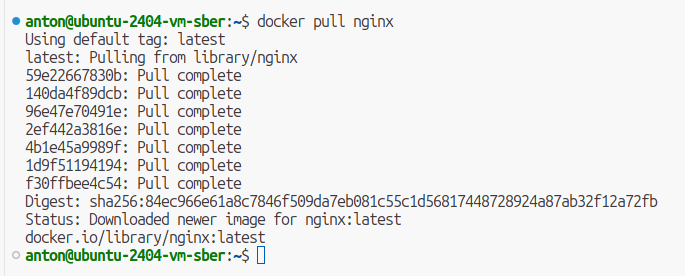  
    *Рис. 1. Результат выполнения команды `docker pull`*

- Проверил наличие докер-образа через docker images

    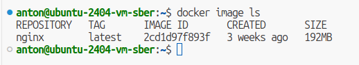  
    *Рис. 2. Результат выполнения команды `docker image ls`*

- Запустил докер-образ через `docker run -d nginx:latest`

    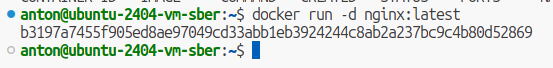  
    *Рис. 3. Результат выполнения команды `docker run -d nginx:latest`*

- Провер, что образ запустился через `docker ps`

    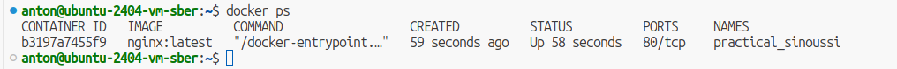  
    *Рис. 4. Результат выполнения команды `docker ps`*

- Посмотрел информацию о контейнере через `docker inspect`

    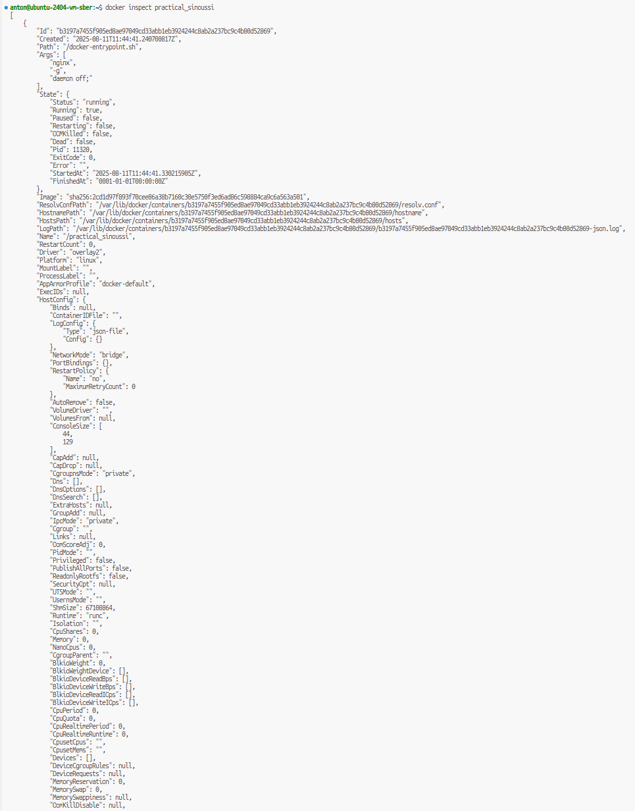  
    *Рис. 5. Результат выполнения команды `docker inspect`*  

    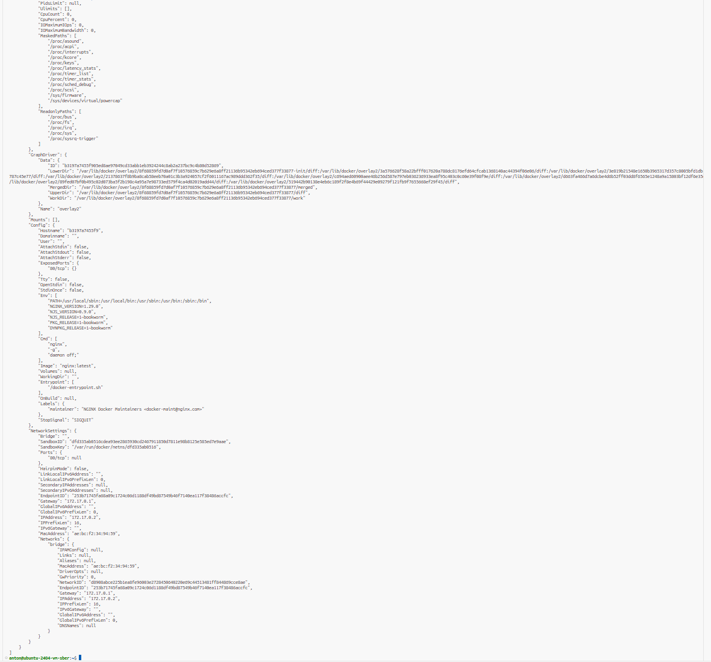  
    *Рис. 6. Результат выполнения команды `docker inspect` (продолжение вывода)*

- По выводу команды определил и поместил в отчёт размер контейнера, список замапленных портов и ip контейнера

    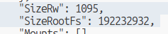  
    *Рис. 7. Размер контейнера*  

    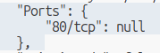  
    *Рис. 8. Список замапленных портов*  

    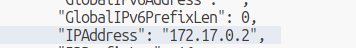  
    *Рис. 9. ip контейнера*

- Остановил докер контейнер через `docker stop`. Проверил, что контейнер остановился через `docker ps`

    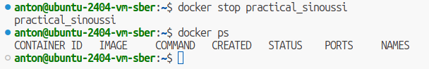  
    *Рис. 10. Результат выполнения команд `docker stop`, `docker ps`*

- Запусти докер с портами 80 и 443 в контейнере, замапленными на такие же порты на локальной машине, через команду `docker run -p 80:80 -p 443:443 -d nginx:latest`

    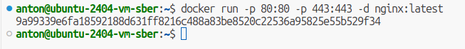  
    *Рис. 11. Результат выполнения команды `docker run -p 80:80 -p 443:443 -d nginx:latest`*

- Проверил, что в браузере по адресу localhost:80 доступна стартовая страница nginx

    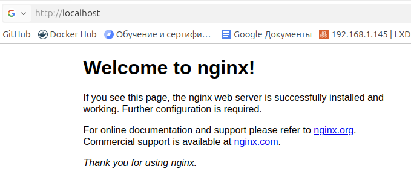  
    *Рис. 12. Стартовая страница nginx*

- Перезапустил докер контейнер через `docker restart`. Проверил через `docker ps`, что контейнер запустился

    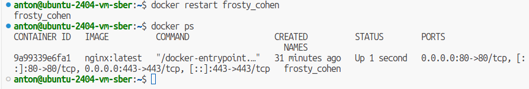  
    *Рис. 13. Результат выполнения команд `docker restart`, `docker ps`*

## Part 2. Операции с контейнером ##

- Прочитал конфигурационный файл nginx.conf внутри докер контейнера через команду exec

    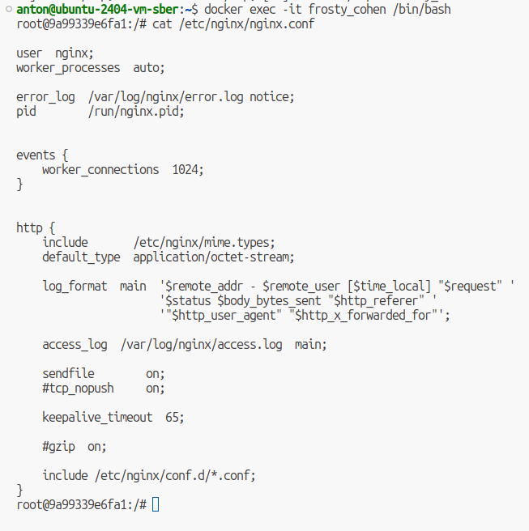  
    *Рис. 1. Результат выполнения команд `docker exec -it frosty_cohen /bin/bash`, `cat /etc/nginx/nginx.conf`*

- Создал на локальной машине файл nginx.conf

    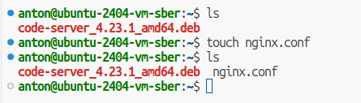  
    *Рис. 2. Результат выполнения команды `touch nginx.conf`*

- Настроил в нем по пути /status отдачу страницы статуса сервера nginx

    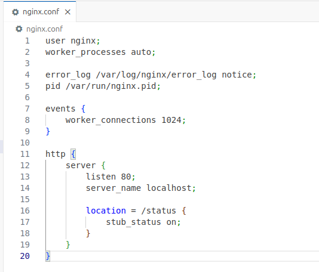  
    *Рис. 3. Содержимое файла nginx.conf*

- Скопировал созданный файл nginx.conf внутрь докер-образа через команду `docker cp nginx.conf frosty_cohen:/etc/nginx/`. Перезапустил nginx внутри докер-образа через команду `docker exec -it frosty_cohen nginx -s reload`

    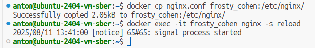  
    *Рис. 4. Результат выполнения команд `docker cp nginx.conf frosty_cohen:/etc/nginx/`, `docker exec -it frosty_cohen nginx -s reload`*

- Проверил, что по адресу localhost:80/status отдается страничка со статусом сервера nginx

    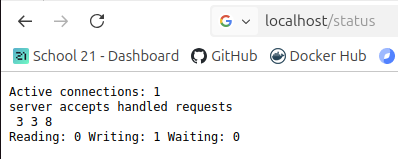  
    *Рис. 5. Страничка со статусом сервера nginx*

- Экспортировал контейнер в файл container.tar через команду `docker export -o container.tar frosty_cohen`

    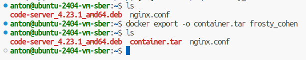  
    *Рис. 6. Результат выполнения команды `docker export -o container.tar frosty_cohen`*

- Остановил контейнер

    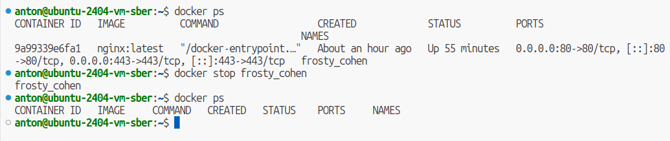  
    *Рис. 7. Результат выполнения команды `docker stop frosty_cohen`*

- Удалил образ через `docker rmi -f nginx:latest`, не удаляя перед этим контейнеры

    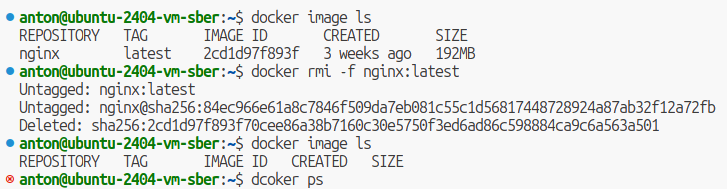  
    *Рис. 8. Результат выполнения команды `docker rmi -f nginx:latest`*

- Удали остановленный контейнер

    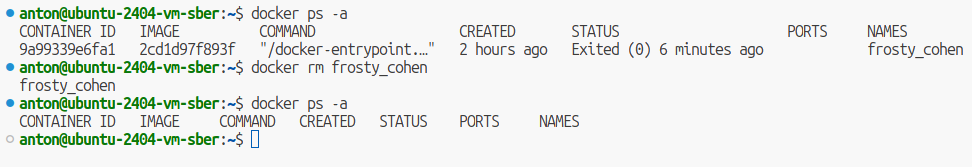  
    *Рис. 9. Результат выполнения команды `docker rm frosty_cohen`*

- Импортировал контейнер обратно через команду `docker import -c 'CMD ["nginx", "-g", "daemon off;"]' container.tar nginx`. Запустил импортированный контейнер командой `docker run -p 80:80 -p 443:443 -d nginx:latest`

    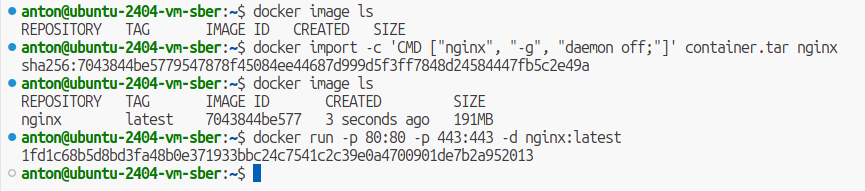  
    *Рис. 10. Результат выполнения команд `docker import -c 'CMD ["nginx", "-g", "daemon off;"]' container.tar nginx`, `docker run -p 80:80 -p 443:443 -d nginx:latest`*

- Проверил, что по адресу localhost:80/status отдается страничка со статусом сервера nginx

    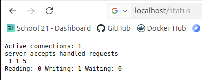  
    *Рис. 11. Страничка со статусом сервера ngin*
