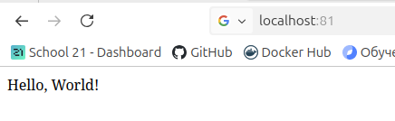

## Part 3. Мини веб-сервер ##

- Написал мини-сервер на C и FastCgi, который будет возвращать простейшую страничку с надписью Hello, World!

      
    *Рис. 1. Мини-сервер на C и FastCgi*

- Запусти написанный мини-сервер через spawn-fcgi на порту 8080

      
    *Рис. 2. Запустил сервер*

- Написал свой nginx.conf, который будет проксировать все запросы с 81 порта на 127.0.0.1:8080

      
    *Рис. 3. Файл nginx.conf*

- Запустил локально nginx с написанной конфигурацией

      
    *Рис. 4. Запуск nginx.conf*

- Проверил, что в браузере по localhost:81 отдается написанная страничка

      
    *Рис. 5. Страничка*